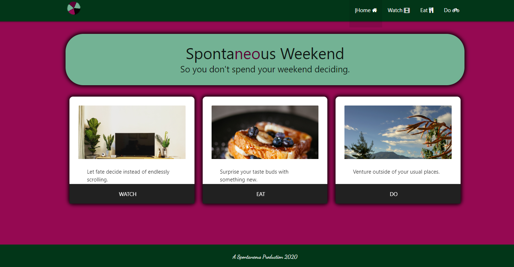
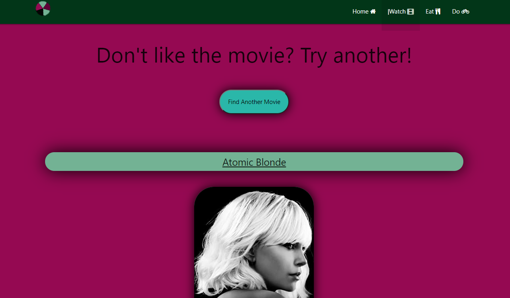
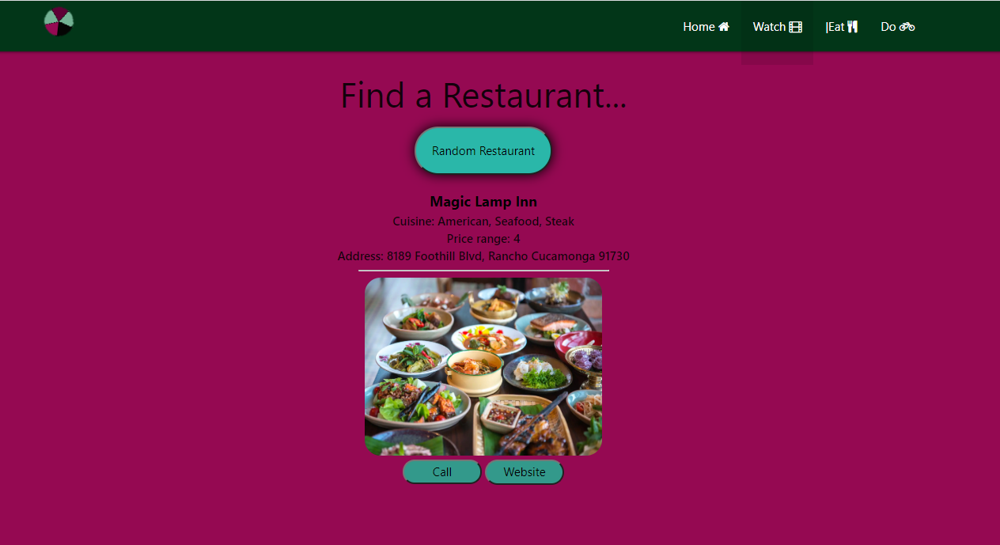
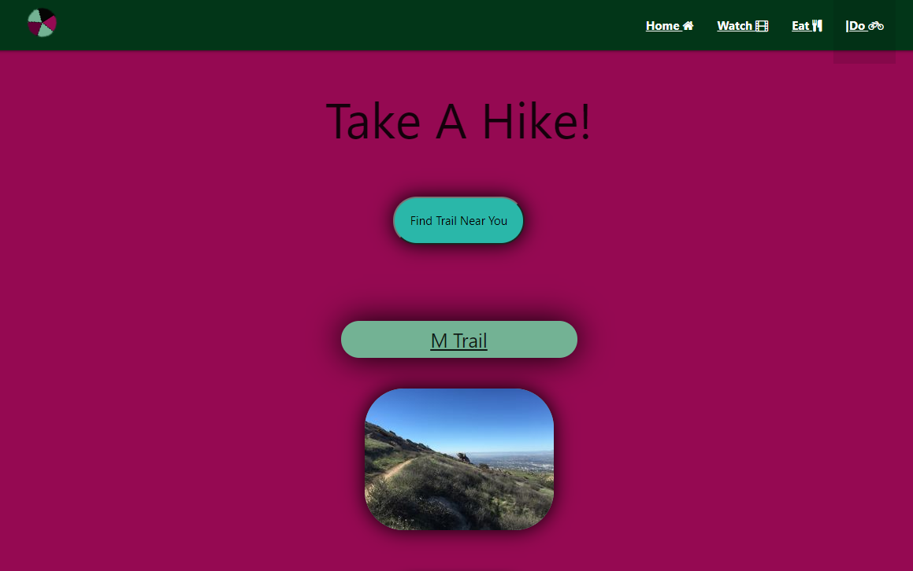

# Spontaneous Weekend Planner

## Description

This is an app designed with today's overwhelmed consumer in mind. With so many choices, how do you ever make a decision?

User Story:
As someone who is faced with too many choices,
I want to narrow down my options
so that I can enjoy a weekend without decision making.

Elevator Pitch:
How much time do you waste before settling on a decision about what to do with your weekend? Whether it’s mind numbing hours scrolling through Netflix, a hangry argument with friends over where to eat, or precious hiking time wasted while choosing a destination, deciding is never the fun part. That’s where our new app, Spontaneous Weekend, comes in. We’ll randomly pick a movie, restaurant, or hike for you, taking away the pain of indecision. This is an app for everyone, so give us a try this weekend and we’ll bring a little spontaneity into your life.

## Usage

Our app is easy to use on any size screen. Simply use the navigation bar or the link cards on the home page to get to the activity for which you want a random selection. Once you are on the page, click the button to generate your first random option. Not happy with the first pick or want to see more? Click that button again!

Home Page:
Website: <https://cyrusjose.github.io/Spontaneous-Weekend/index.html>

Movies:
Website:<https://cyrusjose.github.io/Spontaneous-Weekend/Assets/tabs/movie.html>

Food:
Website: <https://cyrusjose.github.io/Spontaneous-Weekend/Assets/tabs/food.html>

Outdoors:
Website: <https://cyrusjose.github.io/Spontaneous-Weekend/Assets/tabs/park.html>

Project Board:
<https://github.com/users/cyrusjose/projects/2>

Google Slides link:
https://docs.google.com/presentation/d/1PqUHR504DNTDLY30ljxtIhSAMZTfvXaMHRxlpzdZeFI/edit?usp=sharing

## Credits

Thank you to the UCR Extension Full Stack Boot Camp, with instructor Joe Tanksley. Thanks to our T.A. Adam Abundis for helping us work through some thorny issues in our coding and patiently showing us how to use GitHub correctly.

## License

We chose a permissive GNU license for this project, so that others can use and modify the code for their own purposes, but the source code cannot become proprietary and changes must be documented.
